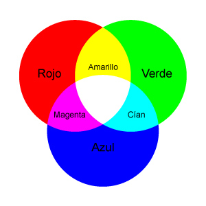

..  Copyright (C)  Mark Guzdial, Barbara Ericson, Briana Morrison
    Permission is granted to copy, distribute and/or modify this document
    under the terms of the GNU Free Documentation License, Version 1.3 or
    any later version published by the Free Software Foundation; with
    Invariant Sections being Forward, Prefaces, and Contributor List,
    no Front-Cover Texts, and no Back-Cover Texts.  A copy of the license
    is included in the section entitled "GNU Free Documentation License".

..  shortname:: Chapter: What You Can Do with a Computer
..  description:: Some tidbits of what you can do with a computer

.. setup for automatic question numbering.

.. 	qnum::
	:start: 1
	:prefix: csp-1-5-

.. |runbutton| image:: Figures/run-button.png
    :height: 20px
    :align: top
    :alt: run button

.. |audiobutton| image:: Figures/start-audio-tour.png
    :height: 20px
    :align: top
    :alt: audio tour button

.. |teachernote| image:: Figures/apple.jpg
    :width: 26px
    :align: bottom
    :alt: teacher note
  

Computación con imágenes
========================

..	index::
	single: images
	
..	index::
	single: pictures
	
..	index::
	single: pixels
	
Las imágenes representadas en un ordenador se descomponen en pequeños elementos llamados **pixels** o **píxeles**, del inglés *picture* (pix) *elements* (els). Estos pixels se distribuyen en una matriz, de izquierda a derecha (dimensión horizontal o eje **x**) y de arriba a abajo (dimensión vertical o eje **y**).

.. figure:: Figures/grid.png
    :align: center
    :alt: A grid with horizontal (x) and vertical (y) dimensions 
    :figclass: align-center
    
    Imagen 1: Una matriz con sus dimensiones horizontal (x) y vertical (y) 

Los pixels son realmente pequeños. La siguiente imagen, aún siendo tan pequeña, está formada por ciento ochenta columnas y doscientas cuarenta filas de pixels (180x240): 

.. figure:: Figures/arch.jpg
    :align: center
    :alt: picture of an arch from Oxford, England
    :figclass: align-center
    
    Imagen 2: Imagen de un arco en Oxford, Inglaterra
    
.. mchoicemf:: 1_5_1_Image_Q1
   :answer_a: De izquierda a derecha
   :answer_b: De derecha a izquierda
   :answer_c: De arriba a abajo
   :answer_d: De abajo a arriba
   :correct: c
   :feedback_a: El valor que se incrementa de izquierda a derecha es el de x
   :feedback_b: El valor que se representa horizontalmente es el de x
   :feedback_c: El valor de y se incrementa de arriba a abajo
   :feedback_d: Esto es lo habitual en un sistema de coordenadas cartesianas, pero no es cierto en este caso
   
   ¿En qué dirección se incrementa el valor de y en una imagen? 

Cada pixel tiene asociado un color: una cantidad de color rojo, una cantidad de verde, y una cantidad de azul. Estas tres cantidades varían en un rango de 0 a 255, siendo 0 la ausencia de color y 255 la mayor cantidad de ese color. Los colores se muestran en pantalla por medio de luz, no de pintura, así que funciona de una manera diferente a la que podrías esperar si mezclas pinturas de colores. Por ejemplo, para obtener pintura de color verde mezclas pintura azul con pintura amarilla, pero para obtener luz amarilla debes mezclar luz roja con luz verde. Visita la página http://www.webexhibits.org/causesofcolor/1BE.html (en inglés) si quieres pobar esto por ti mismo.

    
    Imagen 3: combinación de luces para obtener los distintos colores

Las manipulaciones de imágenes en Photoshop y los filtros en Instagram o Hipstamatic se basan en la alteración de los componentes rojo, verde y azul de cada pixel.

Vamos ahora a eliminar el color rojo de esta imagen. Eso es lo que hace el siguiente programa. 

..	index::
	single: comment
	pair: programming; comment
  
**Este programa tiene muchas líneas. De momento no te preocupes si no entiendes la mayoría de ellas.**

  - Especialmente en los programas para manipular imágenes puedes ignorar la mayoría de las líneas. Algunas hacen referencia a librerías que nos permiten trabajar con imágenes, como ``from image import *``. Otras como ``win = ImageWin(img.getWidth(),img.getHeight())`` y ``img.draw(win)`` nos muestran simplemente el resultado.
  - Ya sabes que el ordenador ignora cualquier texto que aparezca a continuación de ``#``. Son **comentarios** que los humanos escribimos para entender mejor el programa. 
   
  
En el siguiente ejemplo, las líneas importantes son las que aparecen debajo de los comentarios. Pulsa |audiobutton| para escuchar la explicación de cada línea importante. Haz clic en |runbutton| para ejecutar el programa y ver la imagen modificada. Ten paciencia, procesar todos los pixels de la imagen puede llevar unos minutos.

.. raw:: html

    
    
.. activecode:: Images_1
    :tour_1: "Important Lines Tour"; 3,6,10,14: timg1-line361014; 4: timg1-line4; 7: timg1-line7; 8: timg1-line8; 11: timg1-line11; 12: timg1-line12; 15-16: timg1-line15-16;
    :nocodelens:

    from image import *
    
    # CREA UNA IMAGEN CARGADA DESDE UN ARCHIVO
    img = Image("arch.jpg")

    # RECORRE CADA PIXEL DE LA IMAGEN
    pixels = img.getPixels()
    for p in pixels:
    
        # ELIMINA EL ROJO
        p.setRed(0)
        img.updatePixel(p)
           
    # MUESTRA LA IMAGEN UNA VEZ MODIFICADA 
    win = ImageWin(img.getWidth(),img.getHeight())
    img.draw(win)
    
.. mchoicemf:: 1_5_2_Image_Black
   :answer_a: Aún se vería la imagen, pero sólo como tonos de gris.  
   :answer_b: La imagen se vería completamente blanca.
   :answer_c: La imagen se vería completamente negra.
   :correct: c
   :feedback_a: No sucedería eso si cambias por 0 cada componente rojo, verde y auzl.
   :feedback_b: ¿Lo has probado? Esto ocurriría si se cambiaran los valores a 255, no a 0.
   :feedback_c: El negro es la ausencia total de luz, así que cambiando todos los valores a 0 obtendríamos una imagen de color negro, al no haber nada de luz.
   
   ¿Qué crees que ocurriría si cambiaras todos los colores por 0? Intenta añadir las instrucciones ``p.setBlue(0)`` y ``p.setGreen(0)`` al programa después de la sentencia ``p.setRed(0)`` y ejecútalo de nuevo para ver qué sucede.

